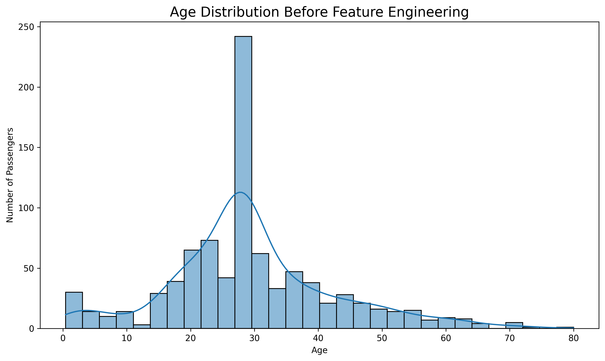
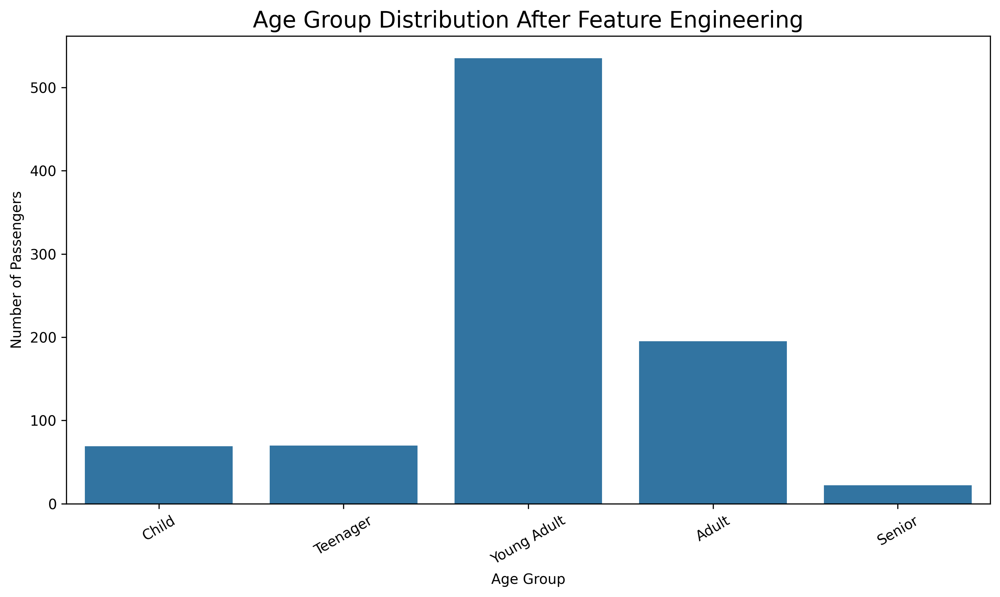
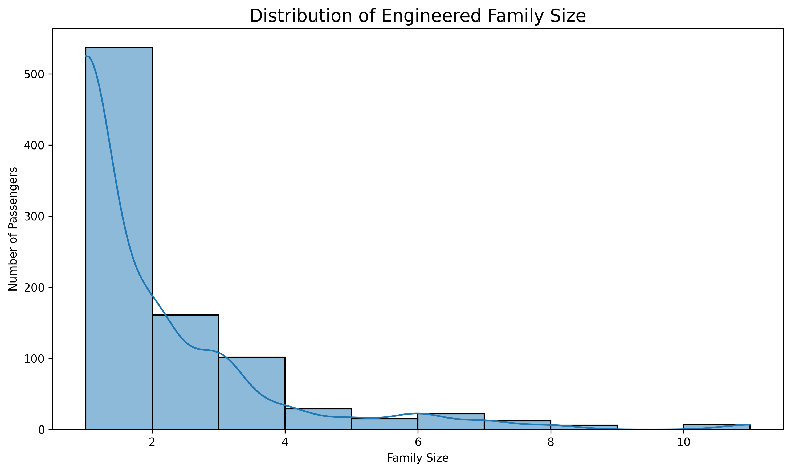
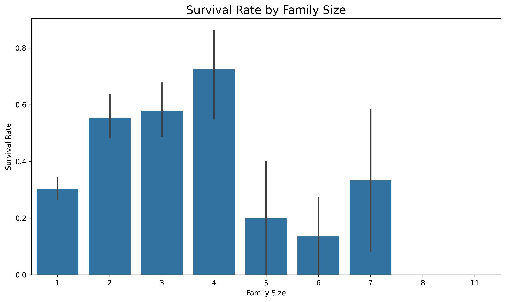
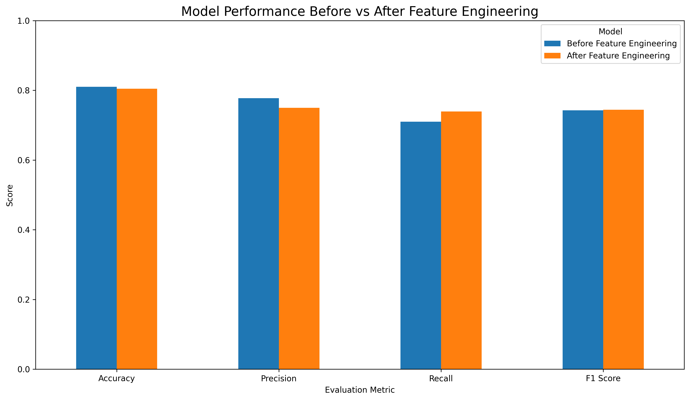
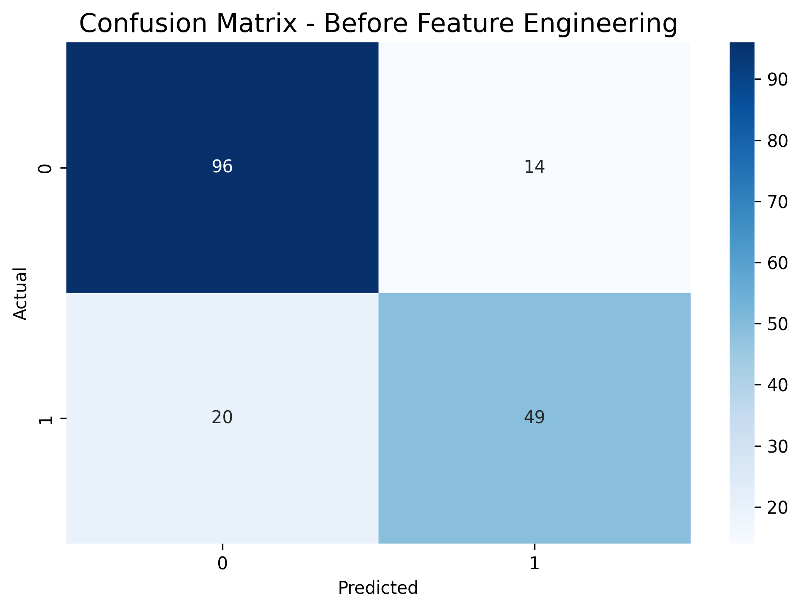
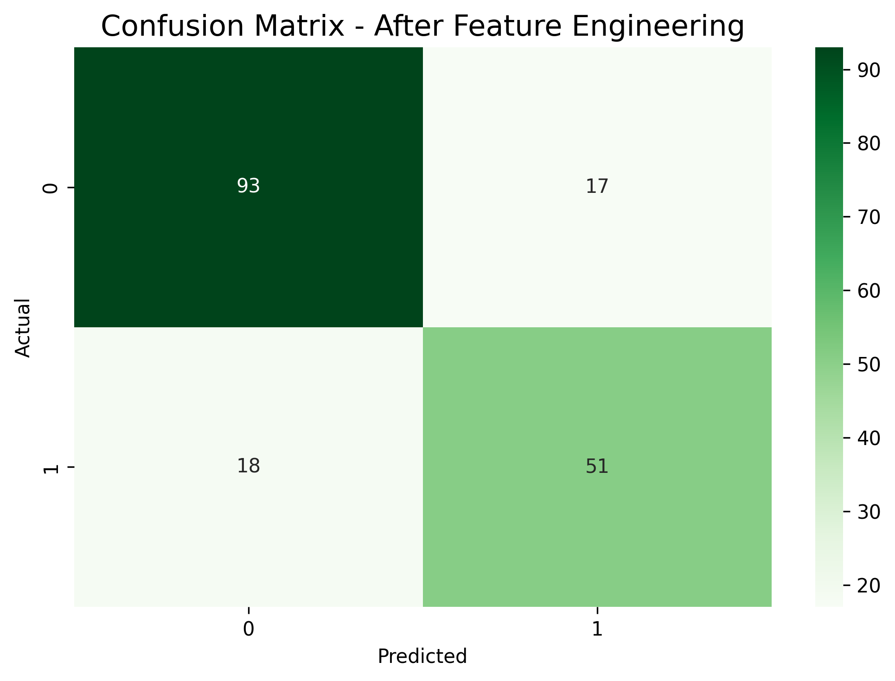
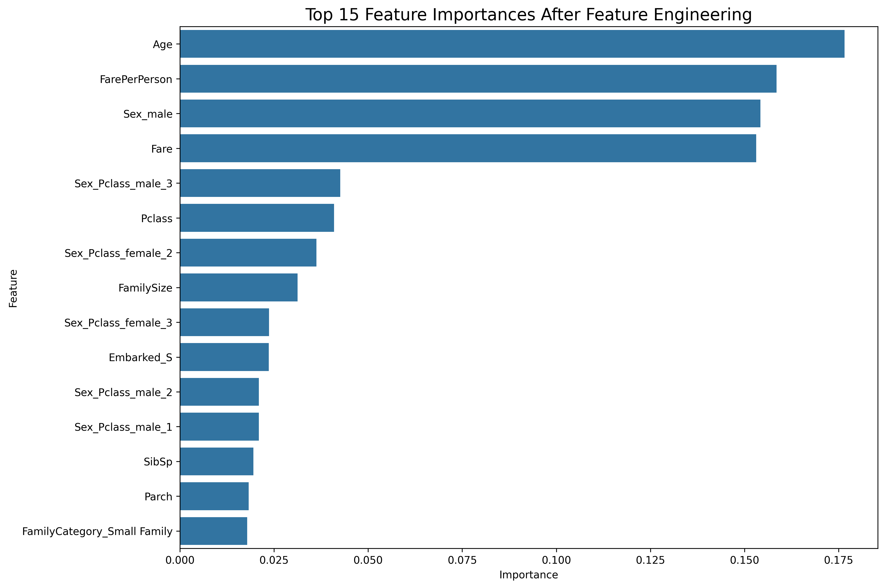
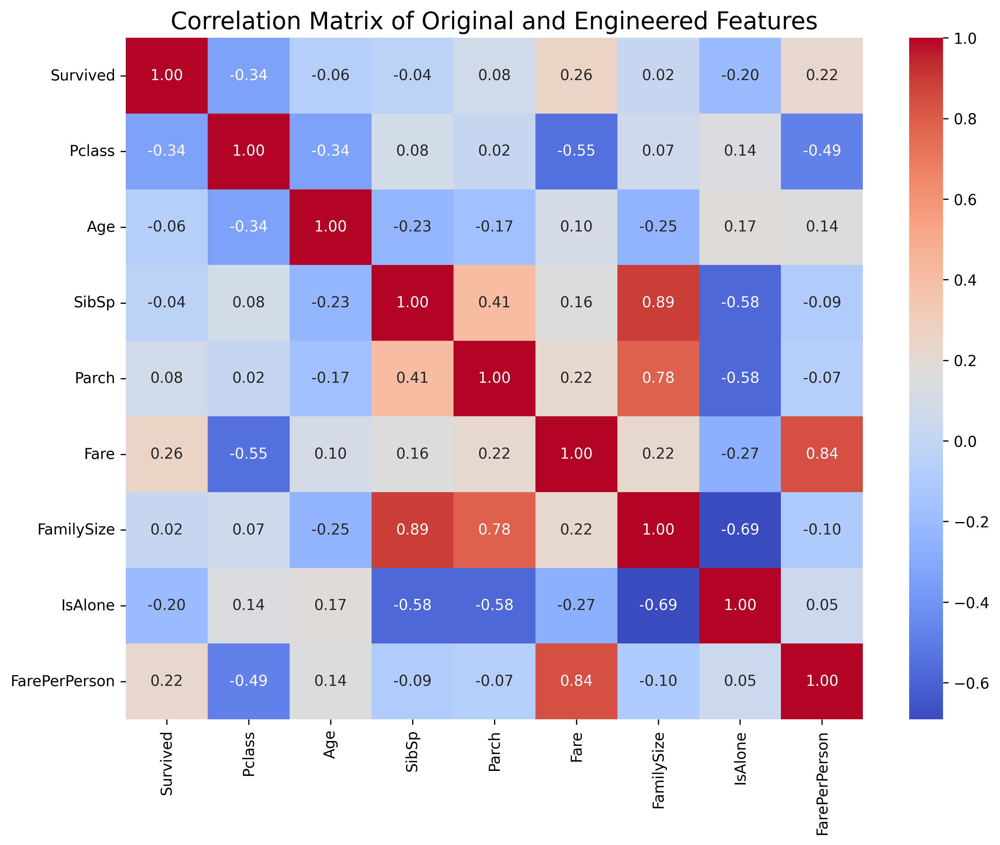

# Feature Engineering for Predictive Modeling Using the Titanic Dataset

## Project Overview

This project demonstrates the application of feature engineering techniques to a structured public dataset to create meaningful variables and evaluate their effect on predictive modeling performance.

The Titanic passenger dataset is used to investigate how transforming existing variables into informative features can support machine learning classification. A Random Forest Classifier is trained before and after feature engineering, and the resulting performance is compared using standard classification metrics.

The project was developed as part of an Artificial Intelligence feature engineering project.

## Objectives

The main objectives of this project are:

* Select and analyze a structured public dataset.
* Perform data cleaning and preprocessing.
* Create meaningful engineered features.
* Apply feature binning techniques.
* Create interaction features.
* Demonstrate date decomposition.
* Visualize distributions before and after feature engineering.
* Train a machine learning model before feature engineering.
* Train the same model after feature engineering.
* Compare model performance using multiple evaluation metrics.
* Analyze feature importance to identify influential variables.

## Dataset

The project uses the Titanic passenger dataset.

The dataset contains information about passengers, including:

* Passenger class
* Sex
* Age
* Number of siblings or spouses aboard
* Number of parents or children aboard
* Passenger fare
* Port of embarkation
* Survival status

The dataset is loaded directly within the notebook from a publicly available source.

## Feature Engineering

Several new features were created from the original variables.

### 1. FamilySize

Family size is calculated using the number of siblings/spouses and parents/children aboard:

```text
FamilySize = SibSp + Parch + 1
```

This feature represents the total number of family members travelling together.

### 2. IsAlone

A binary feature indicating whether a passenger was travelling alone.

```text
1 = Travelling alone
0 = Travelling with family
```

### 3. FarePerPerson

The passenger fare is divided by family size to obtain an approximate fare per family member.

### 4. AgeGroup

Age is transformed into meaningful categorical groups using binning:

* Child
* Teenager
* Young Adult
* Adult
* Senior

### 5. FamilyCategory

Family size is transformed into categorical groups:

* Alone
* Small Family
* Medium Family
* Large Family

### 6. Sex_Pclass

An interaction feature combining passenger sex and passenger class.

This allows the model to represent the combined effect of these two variables.

### 7. Date Decomposition

The Titanic dataset does not contain a passenger-specific date variable. Therefore, the historical voyage date is used as a reference date to demonstrate date decomposition.

The date is decomposed into:

* Voyage Year
* Voyage Month
* Voyage Day
* Voyage Day of Week

## Data Visualization

The project includes visual analysis of the original and engineered features.

### Age Distribution Before Feature Engineering



### Age Distribution After Feature Engineering



### Family Size Distribution



### Survival Rate by Family Size



## Machine Learning Model

A Random Forest Classifier is used for the predictive modeling task.

Two models are evaluated:

1. Baseline Random Forest using the original features.
2. Feature-engineered Random Forest using the original and engineered features.

The same train-test split and model configuration are used to provide a consistent comparison.

## Model Evaluation

The following metrics are used to evaluate model performance:

* Accuracy
* Precision
* Recall
* F1 Score

### Model Performance Comparison



The comparison evaluates whether the engineered features provide additional predictive information compared with the baseline feature set.

## Confusion Matrix Analysis

### Before Feature Engineering



### After Feature Engineering



The confusion matrices provide a class-level comparison of correct and incorrect predictions before and after feature engineering.

## Feature Importance Analysis

Feature importance is obtained from the trained Random Forest model to determine which variables contribute most strongly to the model's predictions.



The feature importance results are also provided as a CSV file in the `results` directory.

## Correlation Analysis

A correlation matrix is used to examine relationships among selected original and engineered numerical features.



## Results

The project compares the baseline and feature-engineered models using:

| Metric    | Before Feature Engineering | After Feature Engineering |
| --------- | -------------------------: | ------------------------: |
| Accuracy  |       Reported in notebook |      Reported in notebook |
| Precision |       Reported in notebook |      Reported in notebook |
| Recall    |       Reported in notebook |      Reported in notebook |
| F1 Score  |       Reported in notebook |      Reported in notebook |

The exact values are generated during notebook execution and are available in:

```text
results/model_comparison.csv
```

## Project Deliverables

The repository contains the following project deliverables:

### Feature Engineering Notebook

```text
notebooks/Feature_Engineering_Titanic.ipynb
```

The notebook contains the complete implementation, including data preprocessing, feature engineering, visualization, model training, evaluation, and feature importance analysis.

### Comparison Charts

```text
reports/Comparison_Charts.pdf
```

This report contains the project's major comparison and evaluation visualizations.

### Feature Importance Analysis Report

```text
reports/Feature_Importance_Analysis.pdf
```

This report presents the feature importance analysis, model performance summary, interpretation, and conclusion.

## Repository Structure

```text
Feature-Engineering-Titanic-ML/
│
├── README.md
├── requirements.txt
├── Feature_Engineering_Titanic.ipynb
│
├── reports/
│   ├── Comparison_Charts.pdf
│   └── Feature_Importance_Analysis.pdf
│
├── results/
│   ├── model_comparison.csv
│   ├── feature_importance.csv
│   └── feature_engineered_titanic.csv
│
└── images/
    ├── age_distribution_before.png
    ├── age_distribution_after.png
    ├── family_size_distribution.png
    ├── survival_by_family_size.png
    ├── model_performance_comparison.png
    ├── confusion_matrix_before.png
    ├── confusion_matrix_after.png
    ├── feature_importance.png
    └── correlation_matrix.png
```

## Technologies Used

* Python
* Pandas
* NumPy
* Matplotlib
* Seaborn
* Scikit-learn
* Jupyter Notebook
* Google Colab

## Installation

Clone the repository:

```bash
git clone https://github.com/YOUR-USERNAME/Feature-Engineering-Titanic-ML.git
```

Navigate to the project directory:

```bash
cd Feature-Engineering-Titanic-ML
```

Install the required dependencies:

```bash
pip install -r requirements.txt
```

## Running the Project

The project can be executed using Google Colab or Jupyter Notebook.

Open:

```text
notebooks/Feature_Engineering_Titanic.ipynb
```

Run the notebook cells sequentially.

The notebook automatically loads the Titanic dataset and performs the complete feature engineering and machine learning workflow.

## Results and Reproducibility

The notebook contains the complete workflow required to reproduce the analysis. Generated model comparison results, feature importance values, and the feature-engineered dataset are provided in the `results` directory.

Visualizations generated during the analysis are stored in the `images` directory, while the final PDF deliverables are available in the `reports` directory.

## Conclusion

This project demonstrates the role of feature engineering in transforming raw structured data into more informative representations for machine learning.

Features representing family structure, age categories, fare distribution, and interactions between passenger characteristics were created and evaluated. The Random Forest model was trained both before and after feature engineering to assess the effect of these transformations on predictive performance.

The feature importance analysis further provides insight into the variables that have the greatest influence on the model's predictions.

## Author

**Arijit Gupta**
